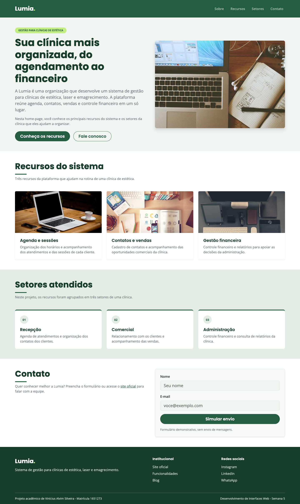
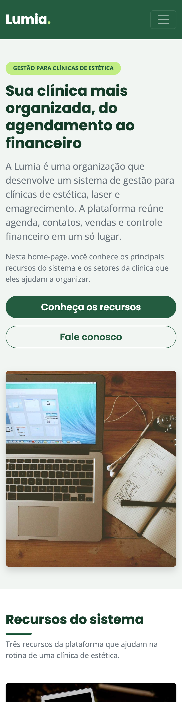
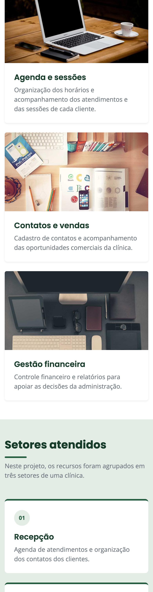
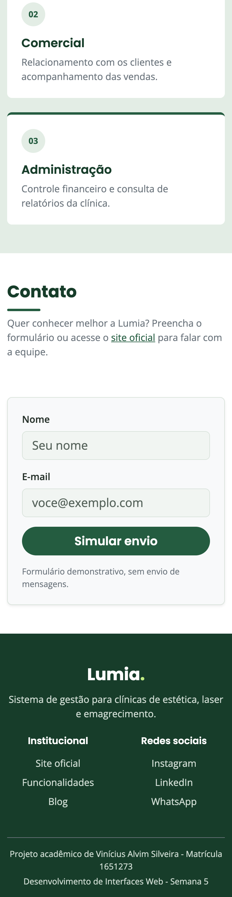

# Trabalho Prático - Semana 5

Home-page responsiva da **Lumia**, evoluída a partir do projeto da semana anterior. A estrutura visual é a mesma, mas a responsividade foi **refeita com o framework Bootstrap 5** no lugar das media queries, do flexbox e do grid escritos à mão.

## Informações Gerais

- Nome: Vinícius Alvim Silveira
- Matricula: 1651273
- Proposta de projeto escolhida: 3. Organizações e Equipes
- Breve descrição sobre seu projeto: Home-page da Lumia, organização que desenvolve um sistema de gestão para clínicas de estética, laser e emagrecimento. A página apresenta a organização, os recursos do sistema (agenda, contatos e vendas, gestão financeira) e os setores da clínica atendidos por eles: recepção, comercial e administração. Nesta semana, o layout responsivo da semana anterior foi refatorado para usar o sistema de grid, os componentes e as classes utilitárias do Bootstrap.

## Print da versão responsiva com Bootstrap [DESKTOP]

Tela de 1440 px de largura. O cabeçalho fica em uma linha, o banner é dividido em duas colunas (texto e imagem), os cards e os setores aparecem em três colunas, o contato em duas e o rodapé em três.



## Print da versão responsiva com Bootstrap [MOBILE] (*)

Celular de 390 × 844 px. Todo o conteúdo fica em uma única coluna e o menu de navegação vira o botão sanduíche do Bootstrap. A página inteira foi capturada e dividida em três partes, colocadas lado a lado.

| 1. Cabeçalho e banner | 2. Cards dos recursos | 3. Setores, contato e rodapé |
| :---: | :---: | :---: |
|  |  |  |

(*) Captura feita no Google Chrome com emulação de celular (390 × 844 px), a mesma função do modo responsivo das ferramentas do desenvolvedor.

## Estrutura do projeto

Seguindo a orientação do template, todo o código da página está na pasta `public`, com os arquivos `index.html` e `styles.css`.

```
public/
├── index.html        home-page (HTML semântico + classes do Bootstrap)
├── styles.css        tema visual da Lumia (cores, fontes e detalhes)
└── img/
    ├── banner.jpg    imagem principal do banner
    ├── agenda.jpg    imagens dos cards
    ├── contatos.jpg
    ├── financeiro.jpg
    └── prints/       capturas usadas neste README
```

## Elementos da home-page

- **`<header>`**: logo "Lumia." e barra de navegação (`<nav>`) com quatro links internos: Sobre, Recursos, Setores e Contato.
- **`<main>`**: banner com a imagem principal e o texto introdutório sobre a Lumia, seguido das seções da página.
- **`<section id="recursos">`**: três cards (`<article>`), cada um com imagem, título e breve descrição de um recurso do sistema.
- **`<section id="setores">`** e **`<section id="contato">`**: setores da clínica atendidos e formulário demonstrativo (sem envio de mensagens).
- **`<footer>`**: links institucionais (site oficial, funcionalidades e blog) e redes sociais da Lumia (Instagram, LinkedIn e WhatsApp).

## Instalação do Bootstrap

O framework foi adicionado **via CDN**, com a tag de estilos no `<head>` e o JavaScript no fim do `<body>` (o pacote `bundle` é o que faz o menu recolhido funcionar no celular):

```html
<link href="https://cdn.jsdelivr.net/npm/bootstrap@5.3.3/dist/css/bootstrap.min.css" rel="stylesheet" ...>
<script src="https://cdn.jsdelivr.net/npm/bootstrap@5.3.3/dist/js/bootstrap.bundle.min.js" ...></script>
```

## Responsividade com Bootstrap

O Bootstrap também trabalha no modelo **mobile first**: as classes sem breakpoint (`col-12`, `row-cols-1`) valem para o celular e as classes com breakpoint (`col-lg-6`, `row-cols-md-2`) entram a partir de uma largura mínima. Os breakpoints usados foram o **md (≥ 768 px)** e o **lg (≥ 992 px)**.

| Parte da página | Celular | Tablet (md) | Desktop (lg) | Classes do Bootstrap |
| --- | --- | --- | --- | --- |
| Cabeçalho | menu escondido atrás do botão sanduíche | logo à esquerda, menu à direita, fixo no topo | igual ao tablet | `navbar navbar-expand-md`, `sticky-top`, `navbar-toggler` + `collapse` |
| Banner | texto acima da imagem | texto acima da imagem | duas colunas: texto e imagem | `row` + `col-12 col-lg-6`, `align-items-center` |
| Botões do banner | um abaixo do outro, com largura total | lado a lado | lado a lado | `d-grid d-sm-flex gap-3` |
| Cards dos recursos | uma coluna | duas colunas | três colunas | `row-cols-1 row-cols-md-2 row-cols-lg-3 g-4` |
| Setores | empilhados | três colunas | três colunas | `row-cols-1 row-cols-md-3 g-4` |
| Contato | texto acima do formulário | texto acima do formulário | duas colunas: texto e formulário | `row g-5` + `col-12 col-lg-6` |
| Rodapé | uma coluna, centralizado | três colunas | três colunas | `row g-4`, `col-md-6`, `col-6 col-md-3`, `text-center text-md-start` |

### Componentes e utilitários utilizados

- **Componentes**: `navbar` com `collapse`, `card` (com `card-img-top` e `card-body`), `badge`, `btn` e os campos de formulário (`form-label`, `form-control`).
- **Grid**: `container`, `row`, `col-*`, `row-cols-*` e as classes de espaçamento entre colunas (`g-4`, `g-5`).
- **Utilitários**: espaçamento (`py-5`, `mb-3`, `p-4`), texto (`fw-bold`, `text-center`, `text-uppercase`, `display-5`, `small`), display (`d-grid`, `d-md-flex`), bordas e sombras (`rounded-3`, `shadow-sm`, `border-top`) e altura (`h-100`, que deixa os cards da mesma linha com a mesma altura).

### O que mudou em relação à versão com CSS puro

| Versão com CSS puro (v1.0) | Versão com Bootstrap (v2.0) |
| --- | --- |
| Duas `@media (min-width: ...)` no fim do `styles.css` | Nenhuma media query própria: os breakpoints vêm das classes `md` e `lg` |
| `display: grid` + `grid-template-columns` nos cards, no banner e no rodapé | Sistema de grid do Bootstrap (`row` / `col-*` / `row-cols-*`) |
| `display: flex` no cabeçalho, no menu, nos setores e nos botões | `navbar-expand-md`, `d-grid d-sm-flex` e o grid do framework |
| Menu sempre visível, centralizado no celular | Menu recolhido no botão sanduíche (componente Collapse) |
| `.container`, `.botao`, `.card` e espaçamentos escritos à mão | Classes prontas do Bootstrap, personalizadas pelas variáveis `--bs-*` |
| 581 linhas de CSS | 196 linhas de CSS, só com o tema da marca |

O `styles.css` continua no projeto, mas agora guarda **apenas o tema visual**: as cores e as fontes da Lumia, as variantes de botão `.btn-lumia` e `.btn-outline-lumia` e alguns detalhes (recorte das imagens com `object-fit`, linha abaixo dos títulos e destaque do foco no teclado). A personalização é feita sobrescrevendo as variáveis CSS do próprio framework (`--bs-body-font-family`, `--bs-btn-bg`, `--bs-navbar-color`...), sem brigar com ele.

## Histórico de desenvolvimento

Cada etapa da atividade foi registrada em um commit:

| Etapa | Commit | O que foi feito |
| --- | --- | --- |
| 1 | `feat: cria estrutura HTML inicial da home-page` | conteúdo do projeto anterior levado para a estrutura do template (`index.html`, `styles.css` e `img/`) |
| 2 | `style: aplica estilos basicos do CSS na home-page` | cores, fontes e espaçamentos, com a página ainda em uma única coluna |
| 3 | `feat: cria versao responsiva da home-page com CSS puro` | flexbox, grid e media queries, versão marcada com a tag **`v1.0`** |
| 4 | `docs: fecha o trabalho com README e prints da versao responsiva` | documentação e prints da versão com CSS puro |
| 5 | `feat: cria versao responsiva da home-page com Bootstrap` | Bootstrap via CDN no lugar das media queries, flexbox e grid próprios, versão marcada com a tag **`v2.0`** |
| 6 | `docs: fecha o trabalho com README e prints da versao Bootstrap` | documentação e prints das versões desktop e mobile com Bootstrap |

Para comparar as duas versões: `git checkout v1.0` (CSS puro) e `git checkout v2.0` (Bootstrap).

## Como visualizar

Abra o arquivo `public/index.html` no navegador (é preciso estar conectado à internet, porque o Bootstrap vem do CDN). Para testar a responsividade, abra as ferramentas do desenvolvedor (F12), ative o modo responsivo e varie a largura da tela.

## Imagens e referências

- As fotografias são do [Lorem Picsum](https://picsum.photos/), reutilizadas do projeto anterior e salvas em `public/img`. Elas não são capturas do sistema Lumia: [banner](https://picsum.photos/id/180/1000/1100), [agenda](https://picsum.photos/id/0/720/480), [contatos](https://picsum.photos/id/20/720/480) e [financeiro](https://picsum.photos/id/60/720/480).
- As informações sobre a Lumia e os links do rodapé têm como referência o [site oficial da Lumia](https://www.lumiaclin.com.br/).
- Fontes Poppins e Open Sans, do [Google Fonts](https://fonts.google.com/).
- Documentação do [Bootstrap 5.3](https://getbootstrap.com/docs/5.3/getting-started/introduction/).
