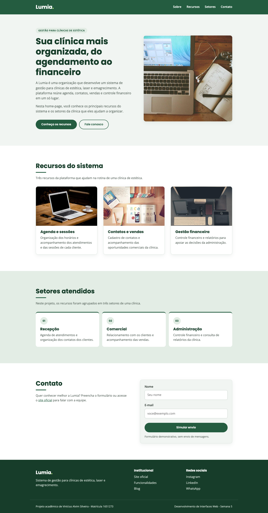
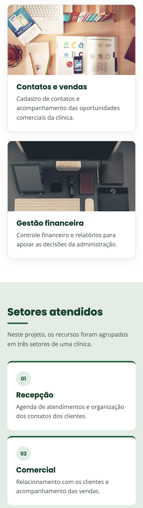
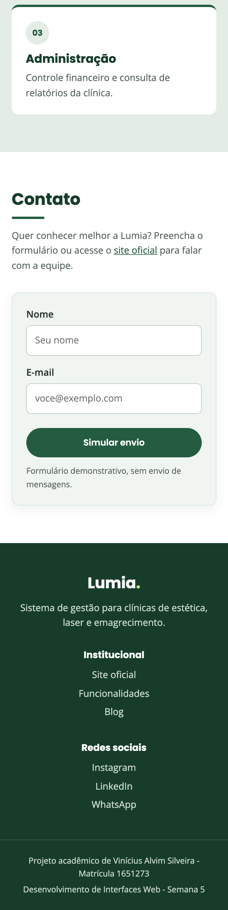

# Trabalho Prático - Semana 5

Home-page responsiva da **Lumia**, evoluída a partir do projeto da semana anterior. A página funciona no celular, no tablet e no desktop usando apenas HTML e CSS puro, sem frameworks.

## Informações Gerais

- Nome: Vinícius Alvim Silveira
- Matricula: 1651273
- Proposta de projeto escolhida: 3. Organizações e Equipes
- Breve descrição sobre seu projeto: Home-page da Lumia, organização que desenvolve um sistema de gestão para clínicas de estética, laser e emagrecimento. A página apresenta a organização, os recursos do sistema (agenda, contatos e vendas, gestão financeira) e os setores da clínica atendidos por eles: recepção, comercial e administração. Nesta semana, o layout da semana anterior foi reorganizado com flexbox, grid e media queries para se adaptar a diferentes tamanhos de tela.

## Print da versão responsiva com CSS puro [DESKTOP]

Tela de 1440 px de largura. O cabeçalho fica em uma linha, o banner é dividido em duas colunas (texto e imagem), os cards e os setores aparecem em três colunas, o contato em duas e o rodapé em três.



## Print da versão responsiva com CSS puro [MOBILE] (*)

Celular de 390 × 844 px. Todo o conteúdo fica em uma única coluna. A página inteira foi capturada e dividida em três partes, colocadas lado a lado.

| 1. Cabeçalho, banner e primeiro card | 2. Cards e setores | 3. Setores, contato e rodapé |
| :---: | :---: | :---: |
|  |  |  |

(*) Captura feita no Google Chrome com emulação de celular (390 × 844 px), a mesma função do modo responsivo das ferramentas do desenvolvedor.

## Estrutura do projeto

Seguindo a orientação do template, todo o código da página está na pasta `public`, com os arquivos `index.html` e `styles.css`.

```
public/
├── index.html        home-page (HTML semântico)
├── styles.css        estilos da página (CSS puro)
└── img/
    ├── banner.jpg    imagem principal do banner
    ├── agenda.jpg    imagens dos cards
    ├── contatos.jpg
    ├── financeiro.jpg
    └── prints/       capturas usadas neste README
```

## Elementos da home-page

- **`<header>`**: logo "Lumia." e barra de navegação (`<nav>`) com quatro links internos: Sobre, Recursos, Setores e Contato.
- **`<main>`**: banner com a imagem principal e o texto introdutório sobre a Lumia, seguido das seções da página.
- **`<section id="recursos">`**: três cards (`<article>`), cada um com imagem, título e breve descrição de um recurso do sistema.
- **`<section id="setores">`** e **`<section id="contato">`**: setores da clínica atendidos e formulário demonstrativo (sem envio de mensagens).
- **`<footer>`**: links institucionais (site oficial, funcionalidades e blog) e redes sociais da Lumia (Instagram, LinkedIn e WhatsApp).

## Responsividade com CSS puro

O CSS foi escrito no modelo **mobile first**. Os estilos base montam a página em uma coluna para o celular, e duas media queries com `min-width` reorganizam o layout em telas maiores. A tag `<meta name="viewport">` faz o navegador do celular usar a largura real da tela.

| Parte da página | Celular (até 699 px) | Tablet (700 a 999 px) | Desktop (a partir de 1000 px) | Recurso |
| --- | --- | --- | --- | --- |
| Cabeçalho | logo e menu centralizados, um abaixo do outro | logo à esquerda, menu à direita, fixo no topo | igual ao tablet | Flexbox |
| Banner | texto acima da imagem | texto acima da imagem | duas colunas: texto e imagem | Grid |
| Botões do banner | um abaixo do outro, com largura total | lado a lado | lado a lado | Flexbox |
| Cards dos recursos | uma coluna | duas colunas, com o último card na linha inteira | três colunas | Grid |
| Setores | empilhados | lado a lado | lado a lado | Flexbox |
| Contato | texto acima do formulário | texto acima do formulário | duas colunas: texto e formulário | Grid |
| Rodapé | uma coluna, centralizado | três colunas | três colunas | Grid |

Variáveis CSS (`:root`) padronizam as cores, as fontes, os espaçamentos e a largura máxima do conteúdo (classe `.container`). No desktop, a media query também aumenta as variáveis de espaçamento.

## Histórico de desenvolvimento

Cada etapa da atividade foi registrada em um commit:

| Etapa | Commit | O que foi feito |
| --- | --- | --- |
| 1 | `feat: cria estrutura HTML inicial da home-page` | conteúdo do projeto anterior levado para a estrutura do template (`index.html`, `styles.css` e `img/`) |
| 2 | `style: aplica estilos basicos do CSS na home-page` | cores, fontes e espaçamentos, com a página ainda em uma única coluna |
| 3 | `feat: cria versao responsiva da home-page com CSS puro` | flexbox, grid e media queries, versão marcada com a tag **`v1.0`** |
| 4 | `docs: fecha o trabalho com README e prints da versao responsiva` | documentação e prints das versões desktop e mobile |

Para ver a versão marcada: `git checkout v1.0`.

## Como visualizar

Abra o arquivo `public/index.html` no navegador. Para testar a responsividade, abra as ferramentas do desenvolvedor (F12), ative o modo responsivo e varie a largura da tela.

## Imagens e referências

- As fotografias são do [Lorem Picsum](https://picsum.photos/), reutilizadas do projeto anterior e salvas em `public/img`. Elas não são capturas do sistema Lumia: [banner](https://picsum.photos/id/180/1000/1100), [agenda](https://picsum.photos/id/0/720/480), [contatos](https://picsum.photos/id/20/720/480) e [financeiro](https://picsum.photos/id/60/720/480).
- As informações sobre a Lumia e os links do rodapé têm como referência o [site oficial da Lumia](https://www.lumiaclin.com.br/).
- Fontes Poppins e Open Sans, do [Google Fonts](https://fonts.google.com/).
